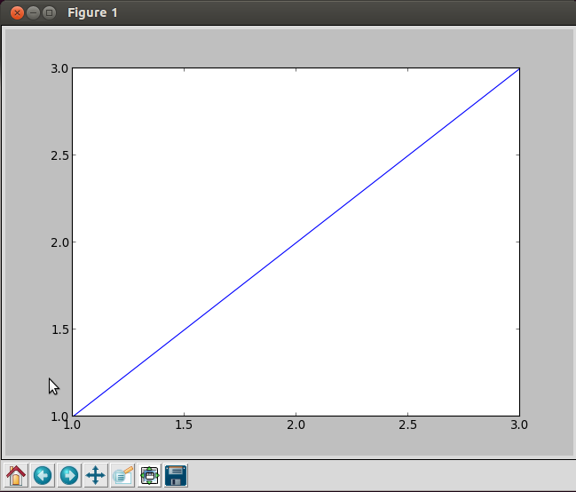
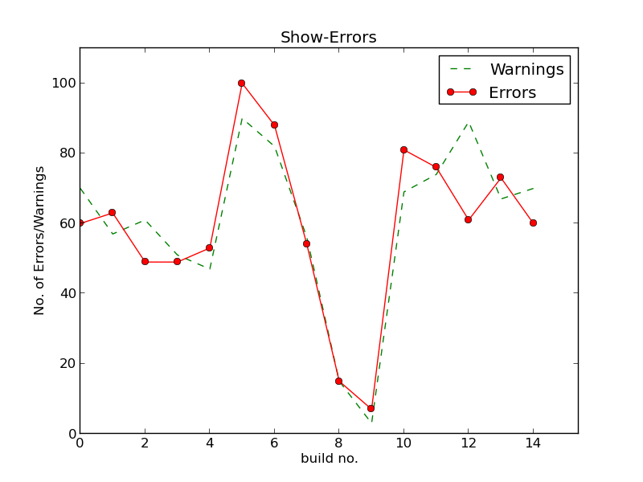

NightOwl - Who tests the unittests?
===================================

`NightOwl` is the wise, selfless guard, that will build, test, deploy and
analyse your software on your embedded target.

At the moment it allows you to filter your warnings and errors from your
`bitbake` outputs (or logs) and generate a graph over Error- and Warning-
development over the last builds. Further development is planned, of course,
in form of a Master's thesis. Finally `NightOwl` should be as powerful in
managing your project's development as
[phpUnderControl|phpundercontrol/phpUnderControl].

Installation
------------

To get started you need: Linux (Ubuntu 12.04 tested), Python2.7, matplotlib
and a shell.

Getting Started
---------------

Because the project is not yet very far developed, this tutorial isn't either.
So I'd like to say sorry for the edges you might hit on your way.

This tutorial assumes that you have a normal Ubuntu 12.04. installation,
without a too fancy configuration. So at first you should make sure,
that you have all the tools installed that you will need. Just execute
the following line of code in a Terminal shell:

    $ sudo apt-get install git jenkins python2.7 python-matplotlib

Now check if everything works correclty. Go to your Terminal and insert the
following commands:

    $ python
    Python 2.7.3 (default, Apr 20 2012, 22:39:59) 
    [GCC 4.6.3] on linux2
    Type "help", "copyright", "credits" or "license" for more information
    >>> import numpy
    >>> import matplotlib.pyplot as plt
    >>> plt.plot([1,2,3],[1,2,3])
    [<matplotlib.lines.Line2D object at 0x2b2d1d0>]
    >>> plt.show()

I won't go too deep into the details. The first command opens the python shell
and shows you the python version. It should be `2.7.x` with any number as `x`.
Then you are in the python shell, which can be seen by the `>>>` in the
beginning of each line. Then you import as 2 commands the important python
libraries. Afterwards you create a small diagram and show it. You should see
something like this:

If you can't start python, or get another version or don't see a diagram after
`plt.show()` then something is wrong. Only continue after all these steps work.

The next step is to check if Jenkins works correctly. To test that, open a
browser and go to `localhost:8080`. The Jenkins start screen should open.

In the next step you should create a new job according to your needs or use
an existing one. I know it sucks, but for now you have to rely on the Jenkins 
documentation for this.

The last prerequesit is to download the night-owl sourcecode. To do that, `cd`
in your shell to whatever place you like. Then write the following:

    $ git clone git@github.com:DFE/night-owl

Now you will see that you have created a subfolder, called `night-owl`, with
all the components that you will need to get night-owl to work. The path
inside this folder is important later on, so remember that I mean this folder,
when I say `<night-owl-path>`.

Now add to your shell script in your Jenkins job the following line:

    # ... other stuff you are doing in your job script
    /bin/bash -x <night-owl-path>/ci-build.sh

and replace your `<night-owl-path>`. Then make sure you Archive artifacts (a
Jenkins config in `Post-build Actions` and add `nightowl*` to your filters.

After your next build you should see 2 new artifacts:

  * nightowl-error.log
  * nightowl-error.png

If you don't see them, something went wrong.

In the last step you go to your job's page in Jenkins and add the following
lines to your Job description:

    <b>
<a href="lastSuccessfulBuild/artifact/nightowl-error.log" >Error Log</a>
</b> 
     
    

After the artifacts are created you can reload the page and see the diagram of
your job's errors and warnings over time. Of course this diagram will not show
so much interesting stuff after 1 or 2 builds. You have to wait some days
until your error.log gets filled up a little.

Skript Examples
---------------

here you can see some examples of what you can do with the night-owl scripts
at the moment:

Examples:

  1. get errorlogs from your bitbake logs

Code:

    $ bitbake myMLO | ./log_errors.py testBuild 1 >error.log
    $ cat error.log
    -------[START:testBuild(1)]-------

    [abc-1.1.1-r123: task do_fetch]
    WARNING: blabla
    ERROR: foo

    [def-1.0.3-r321: task do_build]
    ERROR: oha
    WARNING: bar

    Error count: 2
    Warning count: 2
    -------[END:testBuild(1)]-------

  2. get the same output as json (e.g. to drop it into a database)

Code:

    $ bitbake MLO | ./log_errors.py testBuild 2 >>error.log
    $ cat error.log | ./error_to_json.py
    {"build": "1", "job": "myMLO", "message": "blabla", "task": "abc-1.1.1-r123: task do_fetch", "type": "WARNING"}
    {"build": "1", "job": "myMLO", "message": "foo", "task": "abc-1.1.1-r123: task do_fetch", "type": "ERROR"}
    {"build": "1", "job": "myMLO", "message": "oha", "task": "def-1.0.3-r321: task do_build", "type": "ERROR"}
    {"build": "1", "job": "myMLO", "message": "bar", "task": "def-1.0.3-r321: task do_build", "type": "WARNING"}
    {"build": "1", "count": "2", "job": "myMLO", "type": "WARNING"}
    {"build": "1", "count": "2", "job": "myMLO", "type": "ERROR"}
    {"build": "2", "job": "myMLO", "message": "blabla", "task": "abc-1.1.1-r123: task do_fetch", "type": "WARNING"}
    {"build": "2", "job": "myMLO", "message": "foo", "task": "abc-1.1.1-r123: task do_fetch", "type": "ERROR"}
    {"build": "2", "job": "myMLO", "message": "oha", "task": "def-1.0.3-r321: task do_build", "type": "ERROR"}
    {"build": "2", "job": "myMLO", "message": "bar", "task": "def-1.0.3-r321: task do_build", "type": "WARNING"}
    {"build": "2", "count": "2", "job": "myMLO", "type": "WARNING"}
    {"build": "2", "count": "2", "job": "myMLO", "type": "ERROR"}

  3. graph the errors/warnings over builds

Code:

    $ bitbake MLO | ./log_errors.py testBuild 3 >>error.log
    $ cat error.log | ./error_to_json.py | grep count | ./graph.py build-error Show-Errors

Further Plans
-------------

green = tool
blue = data files and formats

